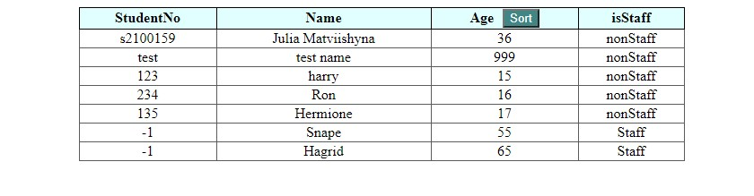

# School Project Add string in table

Practice task - working with array of objects, defining the oldest one, adding them to the table and making button sort. It was made to practice array, objects and DOMContentLoaded event.

## Technologies used

### Built with:

- HTML
- JS
- CSS

No live page

### Authors and acknowledgment:

### Julia Matvi

GitHub @jualiasha

[LinkedIn](www.linkedin.com/in/jualiasha)
