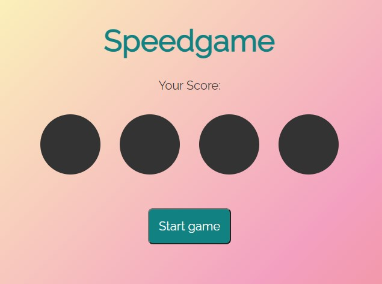

# School Project Speed Game

Practice task - one of the fianl practice vanilla JS tasks to summarize everything learnt and be able to use it.

## Technologies used

### Built with:

- HTML
- JS
- CSS

live page is [here](https://public.bc.fi/s2100159/SpeedGame/)

### Authors and acknowledgment:

### Julia Matvi

GitHub @jualiasha

[LinkedIn](www.linkedin.com/in/jualiasha)
