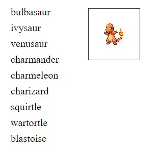

# School Project pokemon API

Practice task on API call, fetch method and asynchronic function (await)

## Technologies used

```js
let resp = await fetch("https://pokeapi.co/api/v2/pokemon?offset=0&limit=1000");
let json = await resp.json();
pokemons = json.results;
```

### Built with:

- HTML
- JS
- Json



no live page

### Authors and acknowledgment:

### Julia Matvi

GitHub @jualiasha

[LinkedIn](www.linkedin.com/in/jualiasha)

```

```
