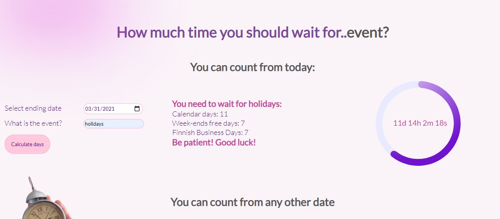

# School Project How much Time

Practice task on Date objects. Getting array of date oeriod and working with it. Excluding week-end and holidays.

## Technologies used

```js
arrayGap.push(new Date(today.setDate(today.getDate() + 1)));
```

### Built with:

- HTML
- JS
- CSS



live page [here](https://public.bc.fi/s2100159/how-much-time/)

### Authors and acknowledgment:

### Julia Matvi

GitHub @jualiasha

[LinkedIn](www.linkedin.com/in/jualiasha)
