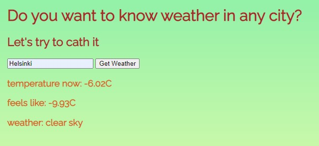

# School Project Dynamic Weather App

Practice task on fetching weather API, using asynchronic function. Using json files.

## Technologies used

### Built with:

- HTML
- JS
- CSS
- Json

live page [here](https://public.bc.fi/s2100159/weather/)

### Authors and acknowledgment:

### Julia Matvi

GitHub @jualiasha

[LinkedIn](www.linkedin.com/in/jualiasha)
