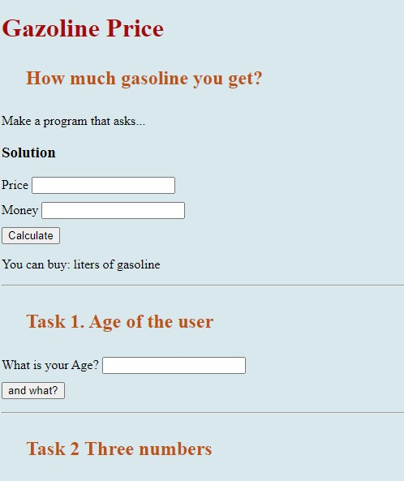

# School Project of basic Calculation of something

Practice task on calculation methods and DOM Elements on the page. Can be useful for calculation purporses of any company

## Technologies used

### Built with:

- HTML
- JS
- CSS

live page [here](https://public.bc.fi/s2100159/Some%20Calculations/)

### Authors and acknowledgment:

### Julia Matvi

GitHub @jualiasha

[LinkedIn](www.linkedin.com/in/jualiasha)
