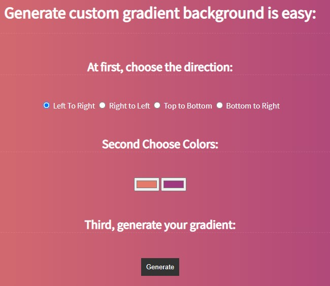

# School Project Dynamic Gradient on the page

Practice task on connecting inputs with js and dom methods of js to change background color and to show css code to user

## Technologies used

### Built with:

- HTML
- JS
- CSS

live page [here](https://public.bc.fi/s2100159/Nice-background/)

### Authors and acknowledgment:

### Julia Matvi

GitHub @jualiasha

[LinkedIn](www.linkedin.com/in/jualiasha)
